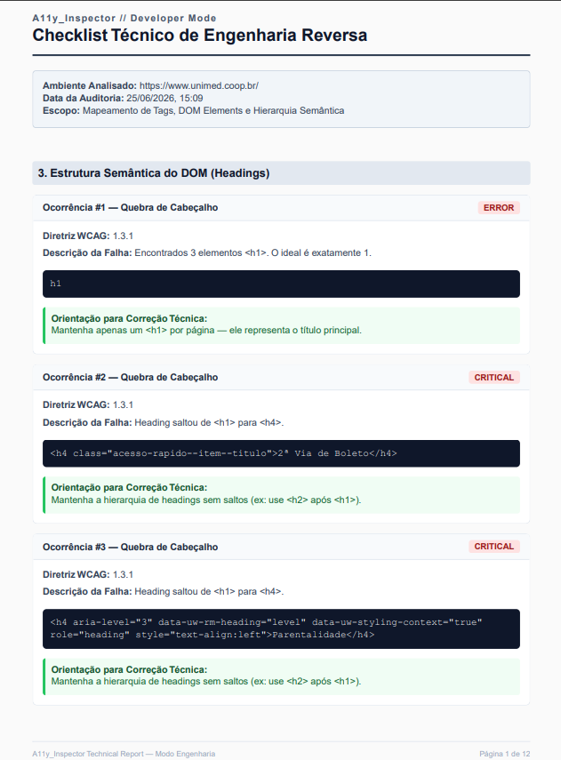

# A11y Inspector

**Auditoria de Acessibilidade Digital com Inteligência Artificial**

---

[](https://python.org)
[](https://fastapi.tiangolo.com)
[](https://react.dev)
[](https://playwright.dev)
[]()
[](https://groq.com)
[](https://docker.com)
[]()

<br/>

> 🔗 **[Acesse a demonstração](https://site-inspector-eq.vercel.app/)** — nenhum cadastro necessário.

<br/>

O **A11y Inspector** é uma ferramenta de auditoria de acessibilidade digital. Ela analisa websites sob demanda, detecta falhas com base nas diretrizes WCAG 2.1 e na Lei Brasileira de Inclusão (LBI), utiliza inteligência artificial para gerar análises estratégicas e produz relatórios PDF prontos para gestores e equipes técnicas.

<br/>


---

## Sobre o Projeto

O A11y Inspector foi construído para resolver um problema específico: automatizar inspeções de acessibilidade digital combinando backend assíncrono, inteligência artificial multimodal e renderização headless — e transformar o resultado em algo útil tanto para engenheiros quanto para gestores.

O backend é escrito em Python com FastAPI, utiliza Playwright para renderizar páginas reais e BeautifulSoup para análise estrutural do HTML. Dois modelos de LLM especializados são consumidos via API Groq: um para gerar descrições alternativas de imagens (multimodal) e outro para produzir relatórios executivos estratégicos adaptados ao segmento de negócio do site alvo (e-commerce, SaaS ou corporativo). O frontend é uma SPA em React com TypeScript que renderiza dois tipos de PDF no client-side.

> **Visão futura.** Este é o primeiro módulo do **SiteInspector**, um projeto guarda-chuva que prevê a criação de uma plataforma modular de auditoria web. Os demais módulos (privacidade, segurança, SEO) estão em estágio de planejamento e não estão implementados.

---

## Problema

A acessibilidade digital deixou de ser apenas uma boa prática. No Brasil, a Lei Brasileira de Inclusão (Lei nº 13.146/2015) estabelece requisitos de inclusão digital, e o descumprimento pode gerar riscos legais, como notificações do Ministério Público, ações civis públicas e outras medidas judiciais.

Apesar desse cenário, muitas organizações ainda dependem de auditorias manuais, ferramentas limitadas ou relatórios excessivamente técnicos, dificultando a identificação, priorização e correção das barreiras de acessibilidade.

O mercado carece de ferramentas que:

- Realizem inspeções automatizadas e sob demanda.
- Traduzam problemas técnicos em informações úteis para gestores e compliance.
- Gerem relatórios técnicos e executivos prontos para tomada de decisão.
- Adaptem recomendações ao contexto de diferentes segmentos, como e-commerce, SaaS e sites institucionais.

---

## Solução

O A11y Inspector resolve esse problema combinando três camadas complementares:

1. **Inspeção automatizada.** Um motor de auditoria percorre o HTML do site alvo e identifica falhas estruturais — imagens sem descrição, formulários sem rótulo, hierarquia de títulos quebrada, links vagos, botões inacessíveis, landmarks ausentes e problemas de navegação por teclado. A análise de contraste de cores é feita sobre o DOM real renderizado via Playwright.

2. **Inteligência artificial contextual.** A ferramenta consome dois modelos distintos da API Groq: um para gerar descrições alternativas de imagens via análise multimodal, e outro para produzir relatórios executivos estratégicos adaptados ao segmento de negócio detectado automaticamente.

3. **Relatórios duplos em PDF.** Cada inspeção gera dois documentos: um Relatório Executivo para gestores e compliance, com análise de risco legal e impacto de negócio; e um Checklist Técnico para desenvolvedores, com ocorrências, snippets HTML e orientações de correção.

---

## Diferenciais

### Pipeline assíncrono com controle de concorrência

Operações de I/O bloqueantes — scraping, download de páginas, chamadas à API Groq — são gerenciadas com `asyncio`, `asyncio.Semaphore` e `asyncio.wait_for`. O loop de eventos do FastAPI nunca é bloqueado, garantindo que o backend mantenha capacidade de resposta sob carga.

### Integração com LLMs via Groq

Dois modelos especializados operam em paralelo:

| Modelo | Finalidade |
|---|---|
| `llama-3.3-70b-versatile` | Geração do relatório executivo estratégico, contextualizado por segmento de negócio |
| `meta-llama/llama-4-scout-17b-16e-instruct` | Geração de texto alternativo (`alt`) para imagens, via análise multimodal |

A detecção do segmento de negócio é feita por regex em Python puro — sem depender de IA para essa classificação, o que mantém a etapa rápida e determinística.

### Renderização real com Playwright

A análise de contraste de cores e o parsing de aplicações single-page (React, Vue, Angular) utilizam o Playwright em modo headless. O DOM analisado é o DOM real renderizado pelo navegador, não o HTML estático do servidor. Uma sessão única é reutilizada durante toda a inspeção, evitando a abertura e fechamento repetidos do navegador.

### Validação e serialização com Pydantic

A hierarquia de modelos (`BaseIssue` → tipos especializados como `ImageAccessibilityIssue`) com tipagem combinatória (`Union`) garante que propriedades específicas de cada tipo de falha — inclusive metadados gerados por IA — sejam preservadas durante a serialização JSON, sem perda de dados.

### Roadmap de prioridades determinístico

As falhas são classificadas em três níveis de prioridade por um algoritmo em Python puro:

- **P1 — Crítico.** Risco legal direto ou bloqueio total de uso.
- **P2 — Alto.** Impacto em conversão e experiência do usuário.
- **P3 — Médio.** Impacto em estrutura, SEO e semântica.

---

## Funcionalidades

| Funcionalidade | Critério WCAG |
|---|---|
| **Auditoria de Imagens** — detecta `alt` ausente e gera descrição automática via IA multimodal | 1.1.1 |
| **Validação de Formulários** — campos sem `label`, `aria-label`, `aria-labelledby` ou `title` | 1.3.1 |
| **Hierarquia de Títulos** — verifica saltos de nível, múltiplos H1 e H1 ausente | 1.3.1 |
| **Links com Texto Vago** — detecta âncoras genéricas como "clique aqui" e "saiba mais" | 2.4.4 |
| **Botões Inacessíveis** — botões sem texto ou `aria-label`, incluindo elementos com `role="button"` | 4.1.2 |
| **Navegação por Teclado** — detecta `tabindex` positivo e elementos interativos não focáveis | 2.1.1 |
| **Landmarks Semânticos** — verifica presença de `<main>`, `<nav>`, `<header>` e `<footer>` | 1.3.6 |
| **Contraste de Cores** — análise dinâmica via Playwright sobre o DOM renderizado | 1.4.3 |
| **Roadmap de Prioridades** — classificação P1/P2/P3 com justificativa de impacto | — |
| **Relatório Executivo com IA** — análise estratégica gerada por segmento de negócio | — |
| **Checklist Técnico em PDF** — ocorrências, snippets HTML e orientações de correção | — |

---

## Principais Recursos em Ação

### Card Detalhado com Sugestão de IA


<br/>

### Relatórios Gerados Automaticamente

Os PDFs são gerados no client-side via `@react-pdf/renderer` ao final de cada inspeção.

#### 1️⃣ Relatório Executivo

| Resumo da Inspeção | Análise Estratégica por IA | Roadmap de Prioridades |
|---|---|---|
|  |  |  |

Destinado a gestores, liderança e compliance.

<br/>

#### 2️⃣ Checklist Técnico



Destinado à equipe de desenvolvimento, contendo ocorrências detalhadas, snippets HTML, critérios WCAG e orientações de correção.

---

## Stack Tecnológica

### Backend

| Tecnologia | Por que foi escolhida |
|---|---|
| **Python 3.11+** | Ecossistema maduro para IA/ML, automação e processamento de dados. |
| **FastAPI 0.136** | Performance assíncrona nativa com `async/await` e validação via Pydantic. |
| **Playwright 1.60** | Renderização headless confiável para análise de contraste e parsing de SPAs. |
| **BeautifulSoup4 + lxml** | Parsing de HTML rápido e tolerante a erros de marcação. |
| **Groq SDK** | API de LLMs com latência reduzida (inferência em hardware LPU dedicado). |
| **Pydantic + Pydantic Settings** | Serialização validada e configuração via `.env` com cache LRU. |
| **Uvicorn 0.48** | Servidor ASGI para aplicações FastAsyncIO. |
| **httpx** | Cliente HTTP assíncrono com keep-alive e timeouts configuráveis. |

### Frontend

| Tecnologia | Por que foi escolhida |
|---|---|
| **React 19 + TypeScript** | Componentização com tipagem estática. |
| **Tailwind CSS 3.4** | Estilização utilitária e responsiva sem arquivos CSS avulsos. |
| **Vite 6.3** | Build tool com hot-reload instantâneo. |
| **@react-pdf/renderer** | Geração de PDF no client-side sem servidor dedicado. |

### Infraestrutura

| Tecnologia | Por que foi escolhida |
|---|---|
| **Docker** | Imagem oficial `playwright/python` com todas as dependências de sistema. |
| **Render** | Deploy do backend containerizado com suporte nativo a Docker. |
| **Vercel** | Deploy do frontend SPA React com CDN global. |

---

## Arquitetura

A aplicação segue uma arquitetura de duas camadas independentes que se comunicam via API REST.

### Backend (FastAPI)

O backend implementa um pipeline de três estágios:

1. **Coleta.** O motor recebe uma URL, dispara o Playwright em modo headless, carrega a página alvo e executa scripts de extração diretamente no DOM renderizado. Um `asyncio.Semaphore` limita a concorrência e um timeout configurável evita travamentos.

2. **Análise.** O HTML coletado é processado pelo BeautifulSoup para auditoria estrutural (imagens, formulários, headings, links, botões, landmarks, foco). Paralelamente, os dados de cores extraídos pelo Playwright são processados em Python puro para cálculo de contraste segundo a fórmula WCAG 2.1.

3. **Geração de valor.** Os resultados são enriquecidos com IA (descrição de imagens e relatório executivo via Groq) e organizados em um roadmap de prioridades P1/P2/P3. O frontend recebe o payload completo e renderiza os PDFs no client-side.

### Frontend (React SPA)

O frontend é uma aplicação de página única que consome a API do backend. O fluxo de uso é:

- O usuário insere uma URL.
- O frontend envia a URL para o endpoint de inspeção.
- Durante o processamento, um componente de loading exibe o progresso.
- Ao final, os resultados são exibidos em cards categorizados, com opção de baixar os PDFs.

---

## Estrutura do Projeto

```
A11yInspector/
│
├── Dockerfile                          # Imagem Docker com Playwright + Python
├── railway.json                        # Configuração de deploy no Railway
├── runtime.txt                         # Versão do Python (3.11)
├── run.py                              # Entrypoint que carrega .env e inicia Uvicorn
├── .env.example                        # Template de variáveis de ambiente
├── pytest.ini                          # Configuração do pytest
│
├── backend/
│   ├── __init__.py
│   ├── main.py                         # Endpoints FastAPI e orquestração do pipeline
│   ├── requirements.txt
│   ├── config/
│   │   └── settings.py                 # Configurações via Pydantic Settings
│   ├── models/
│   │   └── schemas.py                  # Contratos de dados com herança e tipagem combinatória
│   ├── scanner/
│   │   └── core.py                     # Motor de auditoria estrutural
│   └── utils/
│       ├── ai_assistant.py             # Pipeline Groq (relatório + descrição de imagens)
│       ├── contrast.py                 # Análise de contraste via Playwright
│       ├── color_parser.py             # Parsing de cores CSS
│       ├── html_fetcher.py             # Gerenciador de sessão única do Playwright
│       └── priority.py                 # Gerador de roadmap P1/P2/P3
│
├── frontend/
│   ├── vercel.json
│   ├── .env.production
│   ├── vite.config.ts
│   └── src/
│       ├── App.tsx
│       ├── components/
│       │   ├── UrlForm.tsx
│       │   ├── InspectorLoader.tsx
│       │   ├── ResultCard.tsx
│       │   ├── ExecutiveReportPDF.tsx
│       │   └── TechnicalReportPDF.tsx
│       ├── interfaces/
│       │   ├── AccessibilityResults.ts
│       │   ├── ResultItem.ts
│       │   └── ResultContrast.ts
│       └── services/
│           └── api.ts
│
└── tests/
    ├── __init__.py
    ├── conftest.py
    ├── test_scanner_core.py
    ├── test_contrast.py
    ├── test_color_parser.py
    ├── test_business_segment.py
    └── test_priority.py
```

---

## Testes

| Arquivo | Cobertura |
|---|---|
| `test_scanner_core.py` | Motor de auditoria — imagens, formulários, headings, links, botões, landmarks e navegação por teclado |
| `test_contrast.py` | Cálculo de contraste WCAG 1.4.3 |
| `test_color_parser.py` | Parsing de cores CSS para tuplas RGB |
| `test_business_segment.py` | Detecção de segmento de negócio (e-commerce, SaaS, corporativo) |
| `test_priority.py` | Geração e ordenação do roadmap P1/P2/P3 |

```bash
python -m pytest tests/ -v
# 65 passed in ~1.4s
```

---

## Roadmap

Os itens abaixo representam a visão de evolução do projeto. Apenas o primeiro está implementado.

- **A11y Inspector.** Disponível e em produção.
- **SiteInspector — Landing Page.** Em desenvolvimento.
- **Dashboard com histórico de inspeções.** Planejado.
- **Autenticação de usuários (JWT).** Planejado.
- **Módulo Privacy Inspector.** Planejado.
- **Módulo Security Inspector.** Planejado.
- **Módulo SEO Inspector.** Planejado.
- **API pública com rate limiting.** Planejado.
- **Monitoramento contínuo com alertas.** Planejado.

---

## Licença

Este projeto é proprietário. O código-fonte está disponível publicamente para avaliação técnica, mas não pode ser reutilizado, modificado ou redistribuído sem autorização expressa da autora.

© 2026 Elisiane Quadros. Todos os direitos reservados.

---

## Contato

**Elisiane Quadros**

Desenvolvedora Backend Python | Inteligência Artificial e Automação

[LinkedIn](https://www.linkedin.com/in/elisiane-quadros/) &nbsp;·&nbsp; [GitHub](https://github.com/elisiane-quadros)
