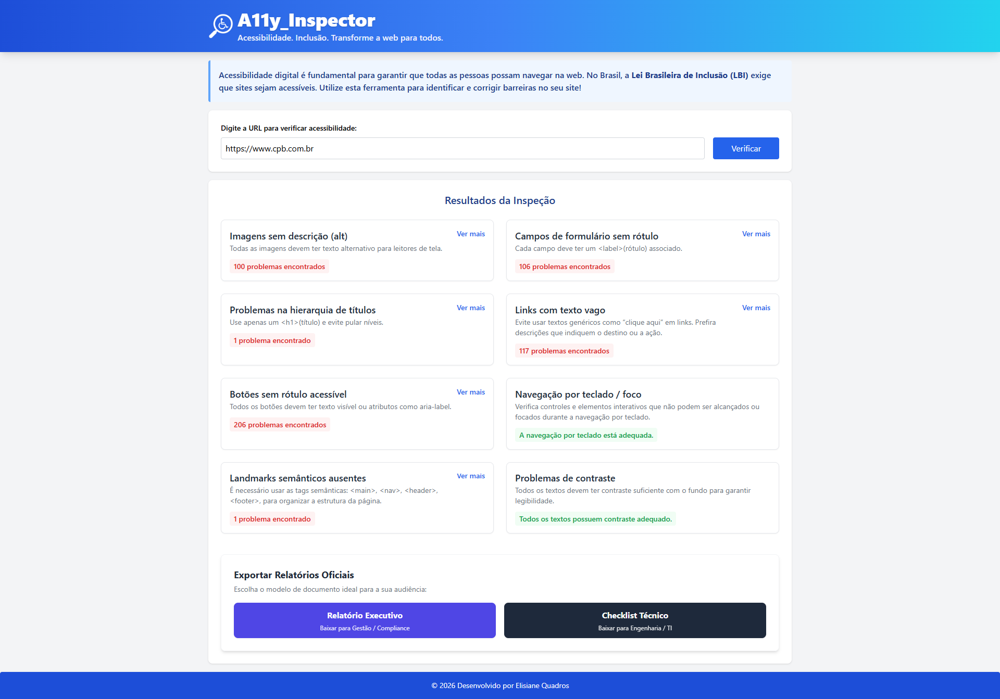
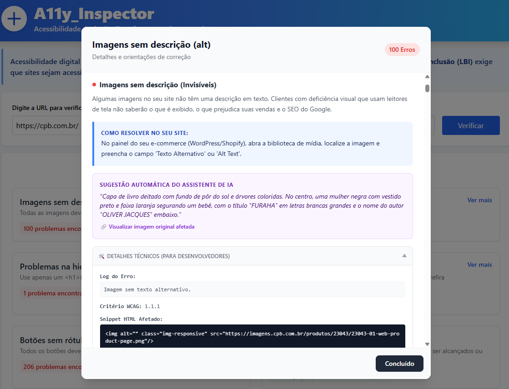
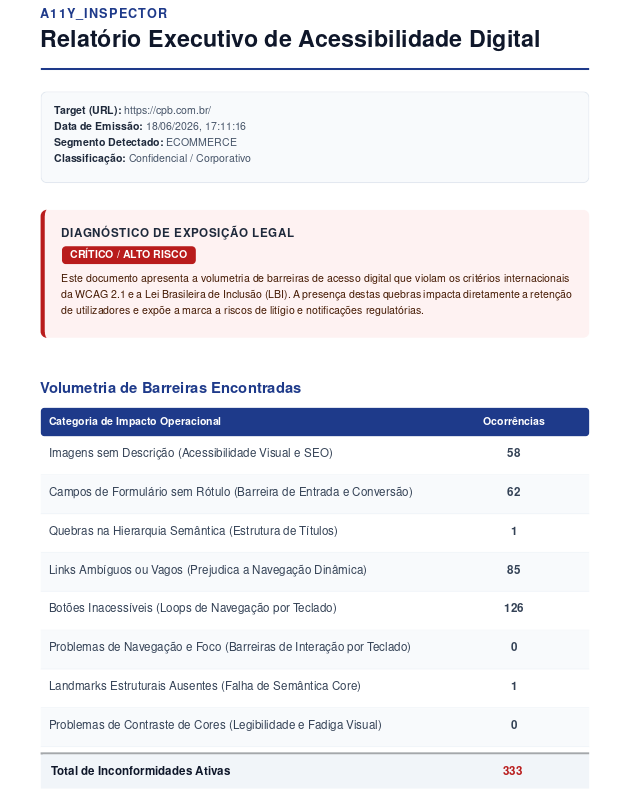
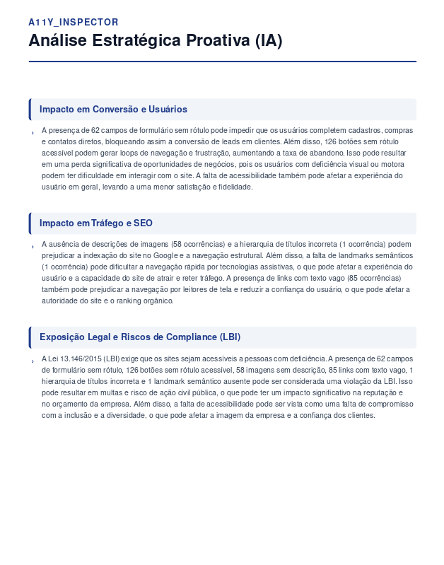
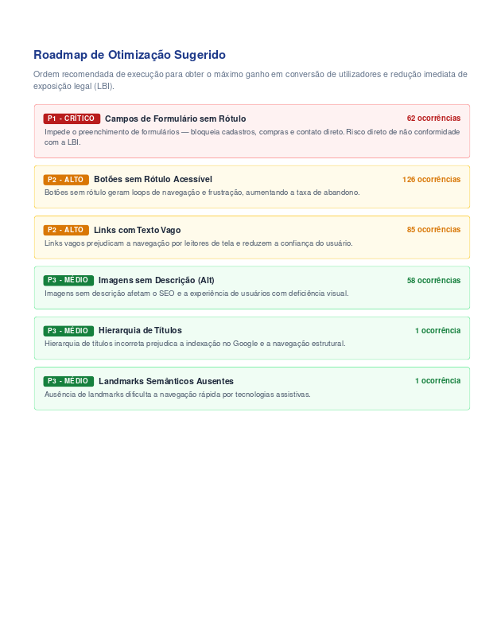

<div align="center">

# 🌐 SiteInspector 🔍

### Plataforma de Auditoria de Acessibilidade Digital com Inteligência Artificial

[](https://python.org)
[](https://fastapi.tiangolo.com)
[](https://react.dev)
[](https://playwright.dev)
[](https://groq.com)
[](https://www.w3.org/WAI/WCAG21/quickref/)
[](https://www.planalto.gov.br/ccivil_03/_ato2015-2018/2015/lei/l13146.htm)
[](LICENSE)

<br/>

> Detecta falhas de acessibilidade em tempo real, gera relatórios PDF profissionais e traduz problemas técnicos em **impacto de negócio** — com análise estratégica gerada por IA adaptada ao segmento do site.

<br/>



</div>

---

## 📋 Índice

- [Sobre o Projeto](#-sobre-o-projeto)
- [Diferenciais Técnicos](#-diferenciais-técnicos--decisões-de-engenharia)
- [Funcionalidades](#-funcionalidades)
- [Interface](#-interface)
- [Tech Stack](#-tech-stack)
- [Estrutura do Projeto](#-estrutura-do-projeto)
- [Instalação e Execução](#-instalação-e-execução)
- [Variáveis de Ambiente](#-variáveis-de-ambiente)
- [Relatórios PDF](#-relatórios-pdf)
- [Deploy](#-deploy)
- [Roadmap](#-roadmap)
- [Autora](#-autora)
- [Licença](#-licença)

---

## 🎯 Sobre o Projeto

**SiteInspector** é uma solução web full-stack para automação de auditoria de acessibilidade digital, desenvolvida em conformidade com as diretrizes [WCAG 2.1](https://www.w3.org/WAI/WCAG21/quickref/) e a [Lei Brasileira de Inclusão (LBI — Lei 13.146/2015)](https://www.planalto.gov.br/ccivil_03/_ato2015-2018/2015/lei/l13146.htm).

O projeto une **engenharia de software**, **automação web (RPA)** e **Inteligência Artificial multimodal** para não apenas detectar falhas em tempo real, mas gerar sugestões de correção contextualizadas e relatórios estratégicos adaptados ao perfil do negócio.

### O grande diferencial: Dualidade de Público

| Público                  | Entrega                                                                       |
| ------------------------ | ----------------------------------------------------------------------------- |
| 👔 Gestores / Compliance | Relatório Executivo com impacto em conversão, SEO e risco legal               |
| 👩‍💻 Desenvolvedores / TI  | Checklist Técnico com snippets HTML, critérios WCAG e orientações de correção |

---

## 🏗️ Diferenciais Técnicos & Decisões de Engenharia

### ⚡ Pipeline Assíncrono com Controle de Concorrência

Operações de I/O bloqueantes (scraping, downloads de mídia, chamadas a APIs externas) são gerenciadas com `asyncio`, `asyncio.Semaphore` e `asyncio.wait_for`, garantindo escalabilidade sem travar o loop de eventos do FastAPI.

### 🤖 Integração com LLMs via Groq (Baixa Latência)

O backend consome dois modelos distintos via API da Groq:

- `llama-3.3-70b-versatile` — geração do **relatório executivo estratégico**, contextualizado por segmento de negócio detectado automaticamente (e-commerce, SaaS ou corporativo)
- `meta-llama/llama-4-scout-17b-16e-instruct` — **geração automática de texto alternativo** (`alt`) para imagens sem descrição, via análise multimodal

### 🔍 Renderização Real com Playwright

A análise de contraste de cores e o parsing de SPAs (React, Vue, Angular) utilizam o **Playwright** em modo _headless_, garantindo que o DOM analisado seja o DOM real renderizado pelo navegador — não o HTML estático.

### 🏗️ Validação e Serialização com Pydantic

Implementação baseada em herança de classes (`BaseIssue` → `ImageAccessibilityIssue`) com tipagem combinatória (`Union`). Impede perda de propriedades específicas de IA durante a serialização de payloads JSON complexos.

### 📊 Roadmap de Prioridades Determinístico

Classificação das falhas em **P1 / P2 / P3** calculada em Python puro (sem IA), baseada no impacto real de cada categoria:

- **P1 Crítico** — Risco legal direto / bloqueio total de uso
- **P2 Alto** — Impacto em conversão e experiência
- **P3 Médio** — Estrutura, SEO e semântica

---

## ✨ Funcionalidades

- 🖼️ **Auditoria de Imagens com IA** — Detecção de `alt` ausente + geração automática de descrição via modelo multimodal da Groq
- 📝 **Validação de Formulários** — Campos sem `<label>`, `aria-label`, `aria-labelledby` ou `title`
- 🔤 **Hierarquia de Títulos** — Verificação da árvore `<h1>` a `<h6>`, incluindo saltos de nível e múltiplos `<h1>`
- 🔗 **Links com Texto Vago** — Detecção de âncoras com texto genérico ("clique aqui", "saiba mais")
- 🖱️ **Botões Inacessíveis** — Identificação de botões sem rótulo acessível ou `aria-label`
- ⌨️ **Navegação por Teclado** — Detecção de `tabindex` positivo e elementos interativos não focáveis
- 🏛️ **Landmarks Semânticos** — Verificação de `<main>`, `<nav>`, `<header>` e `<footer>`
- 🎨 **Contraste de Cores** — Análise dinâmica de legibilidade (WCAG 1.4.3) com Playwright
- 📊 **Roadmap de Prioridades** — Classificação P1/P2/P3 com justificativa de impacto de negócio
- 🤖 **Relatório Executivo com IA** — Análise estratégica gerada pela Groq, adaptada ao segmento detectado
- 📄 **Dois Relatórios em PDF** — Executivo (gestão/compliance) e Técnico (engenharia/TI), gerados no client-side

---

## 🖥️ Interface

<table>
  <tr>
    <td width="50%" align="center">
      <br/>
      <sub><b>Card detalhado com IA</b> — impacto em linguagem de negócio, orientação de correção e <i>alt-text</i> sugerido pela Groq.</sub>
    </td>
    <td width="50%" align="center">
      <br/>
      <sub><b>Relatório executivo (PDF)</b> — diagnóstico de exposição legal e tabela consolidada de barreiras.</sub>
    </td>
  </tr>
  <tr>
    <td width="50%" align="center">
      <br/>
      <sub><b>Análise estratégica por IA</b> — adaptada ao segmento detectado (e-commerce, SaaS ou corporativo).</sub>
    </td>
    <td width="50%" align="center">
      <br/>
      <sub><b>Roadmap P1/P2/P3</b> — priorização determinística com justificativa de impacto.</sub>
    </td>
  </tr>
</table>

---

## 🛠️ Tech Stack

### Backend

| Tecnologia                   | Versão | Uso                                          |
| ---------------------------- | ------ | -------------------------------------------- |
| Python                       | 3.11+  | Linguagem principal                          |
| FastAPI                      | 0.136  | API REST assíncrona                          |
| Playwright                   | 1.60   | Renderização headless e análise de contraste |
| BeautifulSoup4 + lxml        | latest | Parsing de HTML estruturado                  |
| Groq SDK                     | 1.4    | Integração com LLMs (relatório + visão)      |
| Pydantic + Pydantic Settings | 2.x    | Validação de dados e configuração via `.env` |
| wcag-contrast-ratio          | 0.9    | Cálculo de contraste WCAG                    |

### Frontend

| Tecnologia          | Versão | Uso                              |
| ------------------- | ------ | -------------------------------- |
| React               | 19     | Interface baseada em componentes |
| TypeScript          | 5+     | Tipagem estática                 |
| Tailwind CSS        | 3+     | Estilização responsiva           |
| Axios               | latest | Consumo da API                   |
| @react-pdf/renderer | latest | Geração de PDF no client-side    |

---

## 📂 Estrutura do Projeto

```text
SiteInspector/
├── Dockerfile                        # Configuração para deploy com suporte ao Playwright
├── run.py                            # Ponto de entrada: carrega .env e inicia o Uvicorn
├── .env.example                      # Template de variáveis de ambiente
│
├── backend/
│   ├── requirements.txt              # Dependências Python do backend
│   ├── main.py                       # Endpoints FastAPI e orquestração do pipeline
│   ├── config/
│   │   └── settings.py               # Configurações via Pydantic Settings
│   ├── models/
│   │   └── schemas.py                # Contratos de dados (BaseIssue, AnalysisResult, etc.)
│   ├── scanner/
│   │   └── core.py                   # Motor de auditoria (imagens, forms, headings, foco, landmarks)
│   └── utils/
│       ├── ai_assistant.py           # Pipeline Groq (relatório executivo + visão multimodal)
│       ├── contrast.py               # Análise de contraste via Playwright (WCAG 1.4.3)
│       ├── color_parser.py           # Parsing de cores CSS
│       ├── html_fetcher.py           # Sessão única de browser (Playwright) por requisição
│       └── priority.py               # Geração do roadmap de prioridades (P1/P2/P3)
│
├── frontend/
│   ├── .env                          # Variáveis locais (não versionado)
│   ├── .env.production               # Variáveis de produção (Vercel)
│   └── src/
│       ├── components/
│       │   ├── UrlForm.tsx
│       │   ├── ResultCard.tsx
│       │   ├── ExecutiveReportPDF.tsx # PDF para gestão / compliance
│       │   └── TechnicalReportPDF.tsx # PDF para engenharia / TI
│       ├── interfaces/               # Contratos TypeScript espelhando os schemas do backend
│       │   ├── AccessibilityResults.ts
│       │   ├── ResultItem.ts
│       │   └── ResultContrast.ts
│       ├── services/
│       │   └── api.ts                # Cliente Axios configurado
│       └── App.tsx
│
└── tests/
    ├── __init__.py
    └── test_regex.py
```

---

## 🚀 Instalação e Execução

### Pré-requisitos

- Python 3.11+
- Node.js 18+
- Git

### 1. Clonar o repositório

```bash
git clone https://github.com/elisiane-quadros/SiteInspector.git
cd SiteInspector
```

### 2. Configurar o Backend

```bash
# Criar e ativar o ambiente virtual
python -m venv venv

# Windows
venv\Scripts\activate

# Linux / macOS
source venv/bin/activate

# Instalar dependências
pip install -r backend/requirements.txt

# Instalar os binários do Playwright
playwright install chromium
```

### 3. Configurar as Variáveis de Ambiente

```bash
# Copie o template
cp .env.example .env

# Edite o .env e preencha sua chave da Groq
# GROQ_API_KEY=sua_chave_aqui
```

### 4. Iniciar o Backend

```bash
python run.py
```

Backend disponível em: `http://localhost:8000`  
Documentação Swagger: `http://localhost:8000/docs`

### 5. Configurar e Iniciar o Frontend

```bash
cd frontend
npm install
npm run dev
```

Frontend disponível em: `http://localhost:5173`

---

## 🔑 Variáveis de Ambiente

Crie um arquivo `.env` na raiz do projeto baseado no `.env.example`:

| Variável          | Descrição                                                  | Padrão                  |
| ----------------- | ---------------------------------------------------------- | ----------------------- |
| `APP_ENV`         | Ambiente da aplicação                                      | `development`           |
| `ALLOWED_ORIGINS` | URLs com permissão de chamar a API (separadas por vírgula) | `http://localhost:5173` |
| `MAX_ELEMENTS`    | Máximo de elementos analisados por página                  | `200`                   |
| `REQUEST_TIMEOUT` | Timeout em segundos para fetch HTTP                        | `30`                    |
| `GROQ_API_KEY`    | Chave da API Groq ([obter aqui](https://console.groq.com)) | —                       |

---

## 📄 Relatórios PDF

A aplicação gera dois documentos distintos, renderizados no client-side com `@react-pdf/renderer`:

### 📊 Relatório Executivo

Voltado a **gestores e compliance**. Contém:

- Diagnóstico de exposição legal (LBI / WCAG 2.1)
- Volumetria de barreiras por categoria
- Roadmap de otimização P1/P2/P3
- Análise estratégica de impacto gerada por IA (segmentada por nicho)

### 🔧 Checklist Técnico

Voltado a **engenharia e TI**. Contém:

- Lista detalhada de ocorrências por categoria
- Snippet HTML do elemento com problema
- Critério WCAG violado
- Orientação técnica de correção

---

## ☁️ Deploy

| Camada   | Plataforma                     | Observação                                      |
| -------- | ------------------------------ | ----------------------------------------------- |
| Backend  | [Railway](https://railway.app) | Suporte a Docker — necessário para o Playwright |
| Frontend | [Vercel](https://vercel.com)   | Deploy automático via GitHub                    |

### Variáveis necessárias no Railway:

```
GROQ_API_KEY=sua_chave_aqui
ALLOWED_ORIGINS=https://seu-projeto.vercel.app
APP_ENV=production
```

### Variável necessária na Vercel:

```
VITE_API_URL=https://seu-backend.up.railway.app/api
```

---

## 🗺️ Roadmap

- [x] Auditoria de acessibilidade (WCAG 2.1)
- [x] Análise de contraste com Playwright
- [x] Geração de PDF — Relatório Executivo e Checklist Técnico
- [x] Integração com Groq (relatório estratégico + visão multimodal)
- [x] Detecção automática de segmento de negócio
- [x] Roadmap de prioridades P1/P2/P3
- [ ] Autenticação de usuários (JWT)
- [ ] Dashboard com histórico de scans
- [ ] Monitoramento contínuo com alertas por e-mail
- [ ] Plano Pro com API pública
- [x] Unificação do browser Playwright (fetch + contraste em uma única sessão)

---

## 👩‍💻 Autora

<div align="center">

**Elisiane Quadros**

Desenvolvedora Python | IA & Automação aplicadas a Dados e Processos

[](https://www.linkedin.com/in/elisiane-quadros/)

</div>

---

## 📜 Licença

Este projeto está licenciado sob a [MIT License](LICENSE).

---

<div align="center">

Desenvolvido com 💙 por **Elisiane Quadros** — © 2026

_Tornando a web mais inclusiva, um site de cada vez._

</div>
